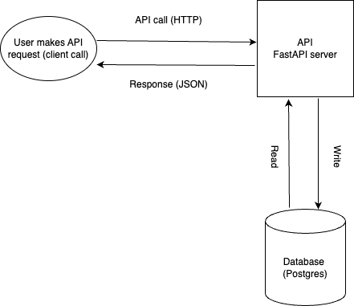

# Student CRUD REST API

This is a simple crud rest api to go through the [SRE Bootcamp exercise](https://playbook.one2n.in/sre-bootcamp/sre-bootcamp-exercises)

# Architecture Diagram


### API Setup

### Step 1: Create virtual environment and install packages
#### 1.1 Create python virtual environment
```
python -m venv venv
```
#### 1.2 Activate python virtual environment
```
source venv/bin/activate
```
#### 1.3 Install python packages
```
pip install -r requirements.txt
```
### Step 2: Configure Environment Variables
Make a copy of `.env.example`. This newly created file should be `.env`
```
cp .env.example .env
```